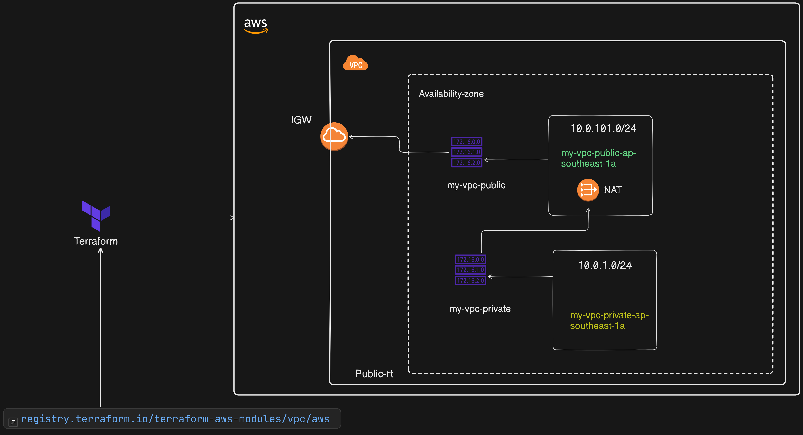

# AWS Network Infrastructure Using Terraform Registry Modules
In this lab, you will learn how to use Terraform modules from the Terraform Registry to create network infrastructure on AWS. This includes setting up a Virtual Private Cloud (VPC), public and private subnets, route tables, and an internet gateway. Terraform modules help you abstract and reuse infrastructure code, making it easier to manage and scale your deployments.

# Scenario Description
You need to set up a networking environment in AWS, including a VPC, public and private subnets, route tables, and an internet gateway. Rather than writing all the configuration from scratch, you will use a module from the Terraform Registry, which simplifies the setup process and ensures that best practices are follow

# Objectives
1. Explore and select a suitable network module from the Terraform Registry.
2. Use the selected module to create a VPC with public and private subnets, route tables, and an internet gateway.
3. Customize the module inputs to fit your project requirements.
4. Apply the Terraform configuration to deploy the network infrastructure.
5. Verify that the network infrastructure is correctly deployed in AWS.

# Step 1: Exploring the Terraform Registry
**Visit the Terraform Registry**
1. Open your web browser and navigate to the Terraform Registry.
2. In the search bar, type "vpc" to search for VPC-related modules.
3. Look for the terraform-aws-modules/vpc/aws module, which is a well-maintained and widely used module for creating VPCs and related networking resources.

# Review the Module Documentation
1. Click on the terraform-aws-modules/vpc/aws module to open its detailed documentation.
2. Review the examples, input variables, and outputs provided in the documentation to understand how the module works and what configurations are required.

